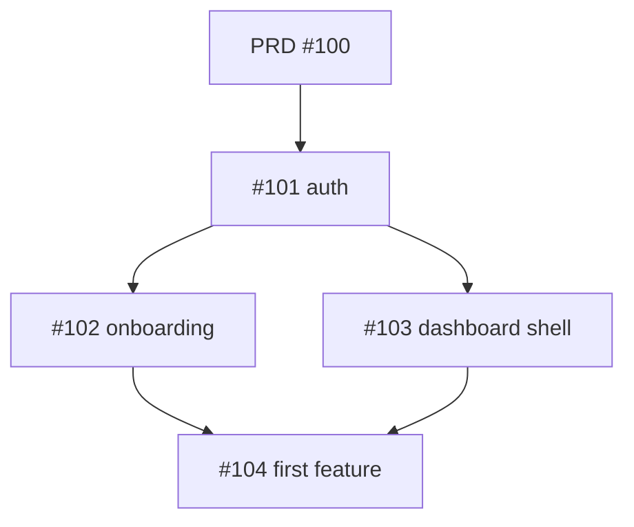

# To Issues

Break a PRD into well-formed child issues. The default unit of work is a **vertical slice** — a thin end-to-end piece that delivers user-visible value, not a horizontal layer.

## Vertical Slice Principle

❌ **Bad decomposition (horizontal):**
- Issue 1: Build the database schema
- Issue 2: Build the API
- Issue 3: Build the frontend

Nothing ships until issue 3 closes. The team is flying blind for weeks.

✅ **Good decomposition (vertical):**
- Issue 1: User can sign up with email (DB + API + UI for this one flow)
- Issue 2: User can verify email (DB + API + UI)
- Issue 3: User can reset password (DB + API + UI)

Each issue, when shipped, makes the product measurably better.

## Process

### 1. Read the PRD
Get it from the parent issue body or `docs/prd/<slug>.md`. Pay particular attention to:
- Section 6 (User Stories) — these are slice candidates
- Section 7 (Functional Requirements) — these are testability anchors
- Section 11 (Integrations) — each integration is usually 1+ issue
- Section 14 (Out-of-Scope) — defends future scope creep

### 2. Identify the user-visible slices
Group user stories and FRs into the smallest shippable units. A slice should answer: *"After this ships, can a user do something they couldn't do before?"*

### 3. Right-size each slice
Target 0.5–3 days of work per issue.
- If bigger → split.
- If smaller → combine.
- If you can't size it → the requirements aren't clear enough; flag it.

### 4. For each slice, draft an issue

Template:

```markdown
## Context
<1–2 sentences. Link to parent PRD issue.>

## Outcome
<The user-visible change after this issue ships. One sentence.>

## Acceptance Criteria
- [ ] Given <state>, when <action>, then <result>
- [ ] Given <state>, when <action>, then <result>
- [ ] Given <state>, when <action>, then <result>

## Out of Scope
<What this issue does *not* cover. Critical for preventing scope creep within the issue.>

## Notes
- **Affects:** <modules / files / surfaces>
- **Depends on:** #<other issue numbers>
- **Blocks:** #<other issue numbers>
- **Estimated size:** XS / S / M

Parent: #<PRD issue number>
```

### 5. Order the issues

Determine dependencies. Mark which can run in parallel vs. which must serialize. Output a Mermaid dependency graph if there are >5 issues:



### 6. Show the user the full plan

Before filing anything:
- Numbered list of issue titles with size estimates
- Dependency graph
- Estimated total effort
- Issues that can run in parallel (so the user can plan stream allocation)

Ask: *"File these as-is, edit first, or split/merge any?"*

### 7. File the issues

For each slice, in dependency order:

```bash
gh issue create \
  --title "<title>" \
  --body-file <temp-file> \
  --label "area:<area>,priority:<p>,size:<size>" \
  --assignee @me
```

Apply labels:
- `area:<frontend|backend|infra|data|integration>`
- `priority:<p0|p1|p2>` (p0 = blocks MVP, p1 = needed for MVP, p2 = post-MVP)
- `size:<xs|s|m>` (no L — if it's L, split it)

Each child issue body must include `Parent: #<parent-issue-number>` so it can be traced back.

### 8. Update the parent issue

Replace the placeholder checklist in the parent issue body with the real list:

```markdown
## Implementation Checklist

### Phase 1 — Foundations
- [ ] #101 User can sign up with email
- [ ] #102 User can verify email
- [ ] #103 User can sign in

### Phase 2 — Core Flow
- [ ] #104 User can create a project
- [ ] #105 User can invite a teammate
- ...

### Phase 3 — Polish
- [ ] #110 Empty states for all primary pages
- [ ] #111 Onboarding tour
```

Use:
```bash
gh issue edit <parent-number> --body-file <new-body-file>
```

### 9. Report back

Summary table:

| # | Title | Labels | Depends on | Size |
| --- | --- | --- | --- | --- |
| #101 | User can sign up | area:auth, p0, s | — | S |
| #102 | User can verify email | area:auth, p0, s | #101 | S |
| ... | | | | |

Plus: *"Total: 12 issues, ~18 days of work, 3 streams can run in parallel after #101."*

## Sizing Heuristics

| Size | Effort | Looks like |
| --- | --- | --- |
| XS | <2h | Copy change, config tweak, single function |
| S | half-day | One endpoint + one UI change |
| M | 1–2 days | New flow, multiple components |
| L | 3+ days | **Split this.** Doesn't fit our discipline. |

If you find yourself writing an "L", you haven't sliced thin enough. Go back.

## Anti-Patterns

- "Build the user model" — not a vertical slice ❌
- "Polish the UI" — not testable ❌
- Issues that depend on 5 other issues to ship anything — too coupled ❌
- Filing issues without showing the user first ❌
- Creating issues that don't link to the parent ❌
- Acceptance criteria that aren't Given/When/Then — not testable ❌
- Skipping the "Out of Scope" section on each issue — invites scope creep ❌
