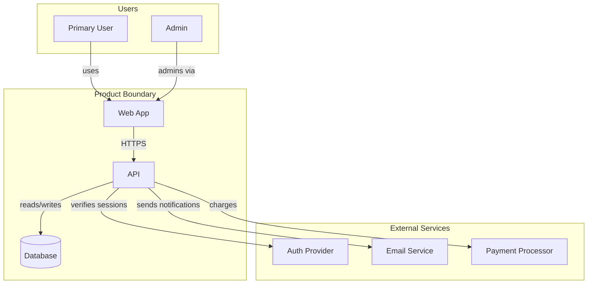
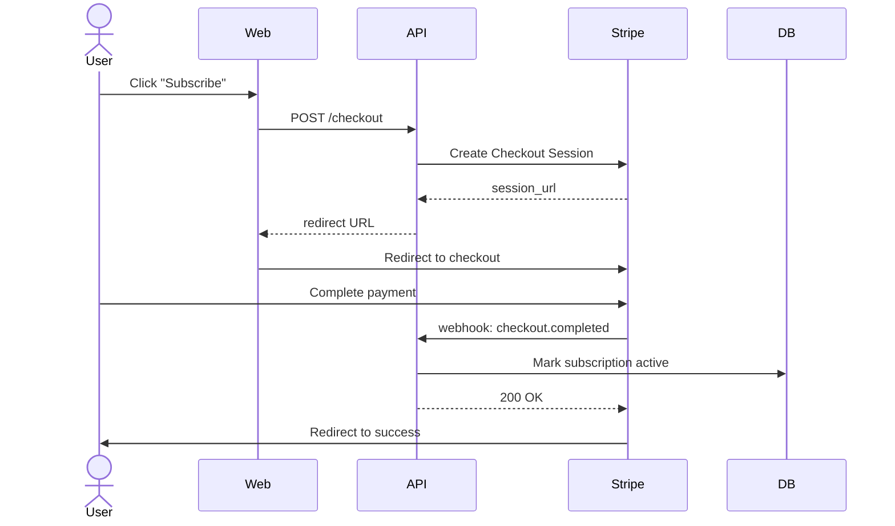
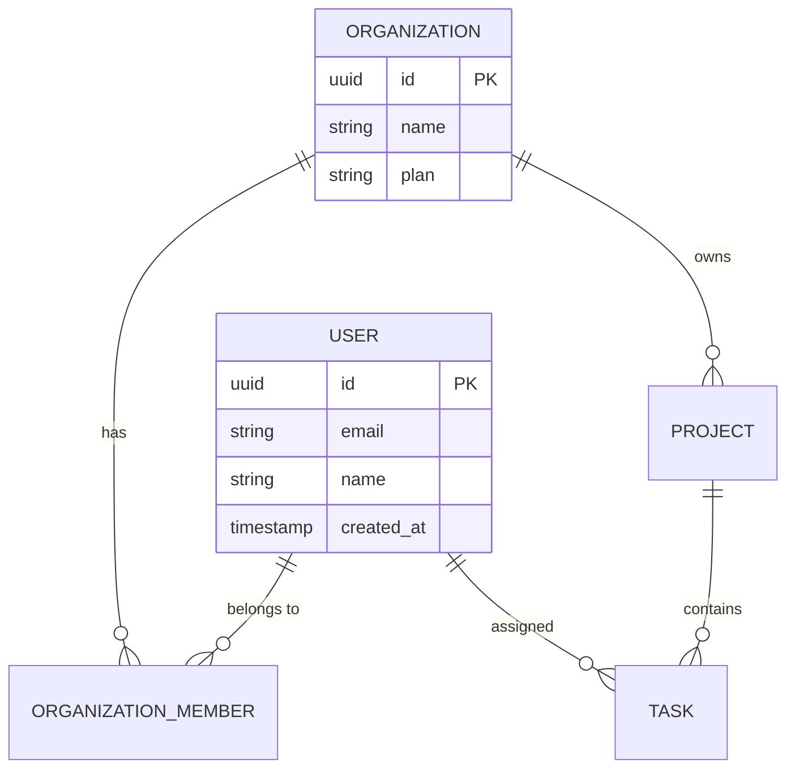
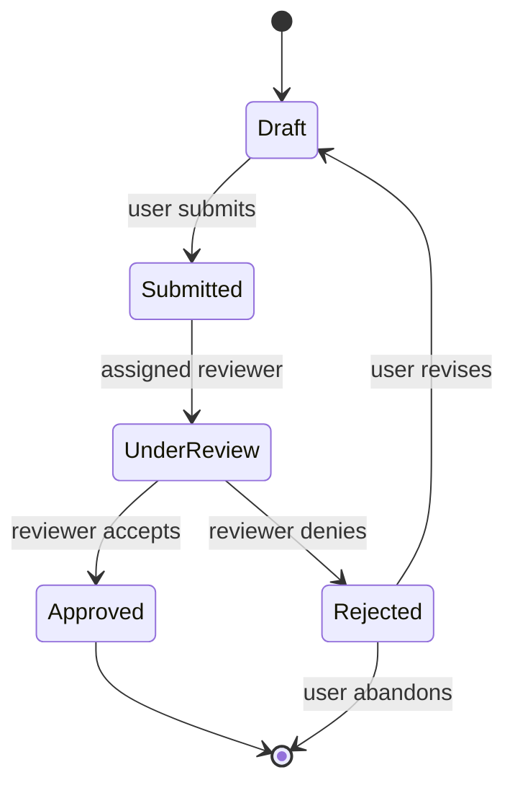

# Architecture Diagram

Pick the right diagram type, write it in Mermaid (so it renders in GitHub issues and PRDs), embed it in section 9 or 10 of the PRD.

## Diagram Selection

| If you need to show… | Use this Mermaid type |
| --- | --- |
| What this system is and what it talks to | `flowchart` (C4 Context level) |
| How a request flows across components | `sequenceDiagram` |
| Data shape and relationships | `erDiagram` |
| State of an entity over time (orders, subscriptions) | `stateDiagram-v2` |
| Deployment topology | `flowchart` with subgraphs for envs |

## Operating Rules

1. **Default to one diagram per PRD.** A C4 Context flowchart. More than that is usually over-spec.
2. **Add a sequence diagram only if there's a non-obvious cross-service flow** (e.g., webhook reconciliation, async billing, OAuth dance).
3. **Add an ER diagram only if the schema is non-trivial** (>5 entities or non-obvious cardinality).
4. **Label everything.** Unlabeled arrows are noise.
5. **Mermaid renders in GitHub.** Always wrap in ` ```mermaid ` fences.

## Process

1. Read PRD sections 9–11 (Tech Stack, Data Model, Integrations).
2. Decide which diagrams are *actually* needed. Don't manufacture diagrams to look thorough.
3. Draft them. Show the user. Iterate.
4. Embed them in the PRD inline. Also save as `docs/prd/<slug>/diagrams/<name>.mmd` for re-use.

## Templates

### C4 Context (default — almost every PRD gets this one)



### Sequence (for webhook reconciliation, OAuth, async flows)



### ER (when the data model is non-trivial)



### State (for entities with non-trivial lifecycle)



## Anti-Patterns

- One giant diagram with everything ❌
- ER diagrams for 2 tables ❌
- Sequence diagrams for synchronous CRUD ❌
- Decorative diagrams that the prose already explains ❌
- Diagrams without arrow labels — readers can't tell direction or semantics ❌
